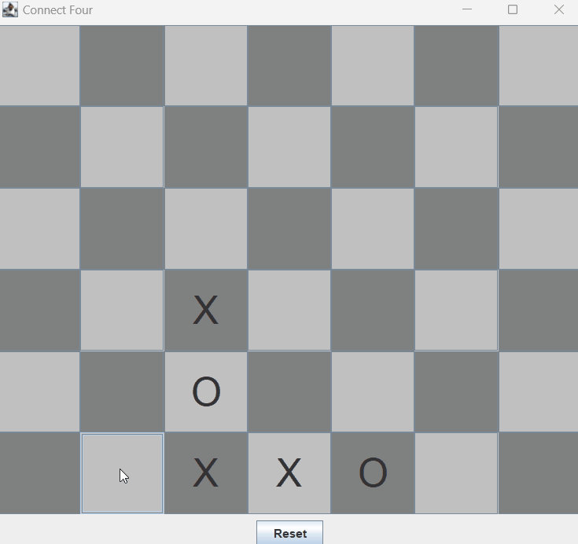

# Connect Four Game (Desktop version)

One of the first projects I've made during Java Developer course by JetBrains Academy.

Hopefully difference between this one and new ones will show my progress. 

Tasks:
1. Create a game board divided into cells using Java Swing library.
2. Enable the cells on the board to accept user input and place the appropriate piece based on a player's turn.
3. Make the cells in a column respond as a unit to fill the board from the bottom row.
4. Add an algorithm to check for a winner after every click and then highlight the winning cells.

To start game use ApplicationRunner
